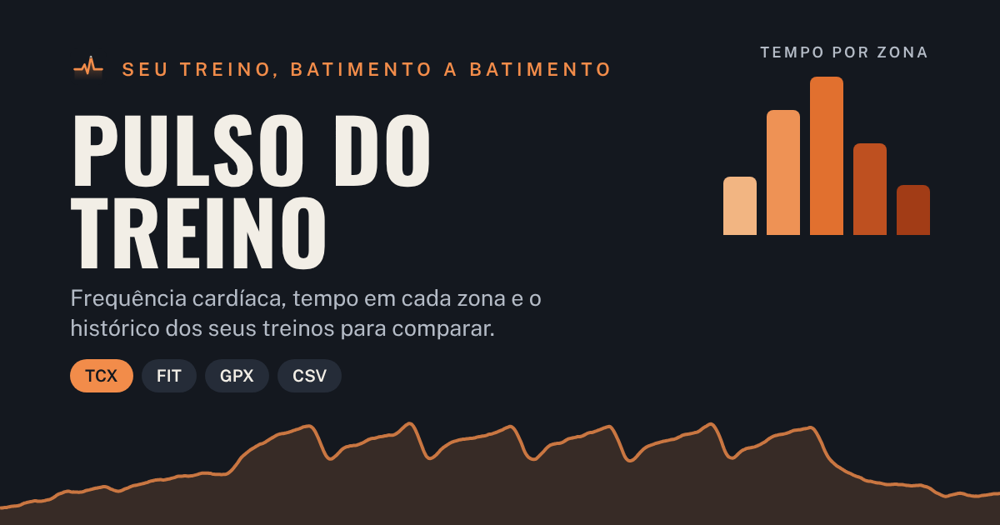

# Pulso do Treino

Aplicativo web para analisar treinos pela frequência cardíaca. Importe o arquivo exportado do relógio
ou do app (TCX, FIT, GPX ou CSV) e veja a curva da FC, o tempo em cada zona, os blocos de esforço, a
recuperação e todos os dados do arquivo. Cada treino fica guardado no histórico, para comparar treinos
entre si. As zonas (Z1 a Z5) são definidas por você na aba **Zonas**.

**Endereço:** https://guiwemery-pixel.github.io/projetoresidencia/treinos/

## Instalar no celular

- **Android (Chrome):** abra o endereço, toque no menu ⋮ e em **Instalar app** (ou **Adicionar à tela inicial**).
- **iPhone (Safari):** abra o endereço, toque em Compartilhar e em **Adicionar à Tela de Início**.

Depois de instalado, o app abre pelo ícone, em tela cheia, e funciona sem internet. Os treinos ficam
guardados no próprio aparelho (no navegador); use **Zonas › Exportar backup** de vez em quando para ter
uma cópia, e **Importar treino** com o arquivo do backup para restaurar ou levar para outro aparelho.

## Publicação

O workflow `.github/workflows/pages.yml` publica esta pasta no GitHub Pages a cada mudança em `treinos/`
no branch principal. Na primeira vez, é preciso ativar o Pages em **Settings › Pages › Build and
deployment › Source: GitHub Actions**.

## Arquivos

| Arquivo | O que é |
|---|---|
| `index.html` | O aplicativo inteiro (também funciona aberto direto do computador, sem servidor) |
| `manifest.webmanifest`, `sw.js` | Instalação na tela inicial e funcionamento sem internet |
| `icones/` | Ícone do app em vários tamanhos |
| `capa.png` | Capa usada quando o link é compartilhado |
